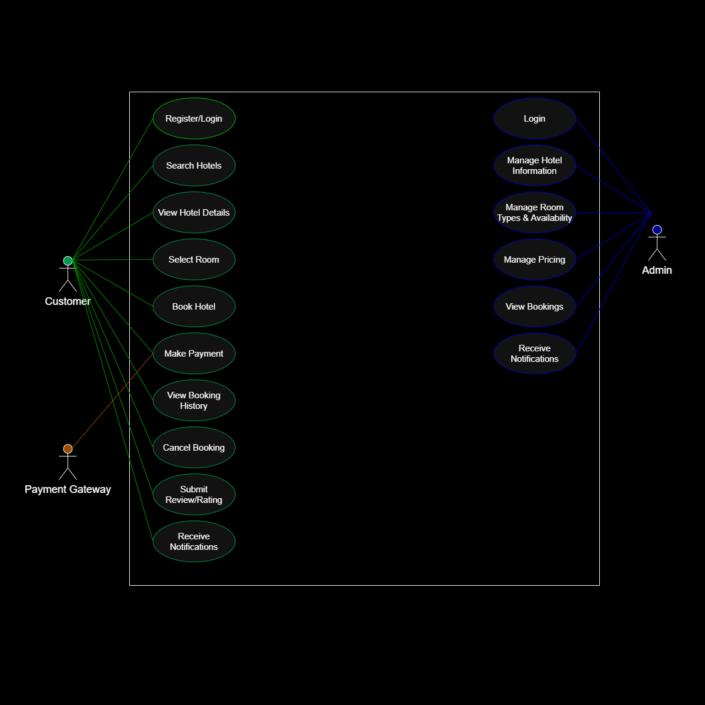

## Requirement Analysis in Software Development
This repository is focused on the Requirement Analysis phase of software development. It is part of a hands-on project where I’ll be analyzing and documenting the requirements for a booking management system. The main goal here is to break down the foundation of a software project before any code is written, identifying what the system needs to do, who will use it, and how it should behave. This is a key step in the Software Development Life Cycle (SDLC) and sets the stage for building reliable, user-focused solutions. Throughout this project, I’ll be applying real-world methods and tools like structured documentation, use case analysis, diagrams (via Draw.io), and acceptance criteria, all to ensure clarity, alignment, and a solid blueprint for development.

## What is Requirement Analysis?
Requirement Analysis is one of the most critical phases in the Software Development Life Cycle (SDLC). It involves gathering, analyzing, validating, and documenting what a software system should do before development begins. In simple terms, it’s about understanding the problem before building the solution.

## Why is Requirement Analysis Important?
Every successful project starts with a clear understanding of what needs to be built. Here’s why requirement analysis is so important:

   -**Clarity and Alignment:** It ensures that everyone such as the developers, designers, testers, clients, and stakeholders, are all on the same page. This avoids confusion, feature creep, and misaligned expectations later in the process.

   -**Guides Design and Development:** Clear requirements act as a roadmap. They influence architecture, UI/UX design, database structure, and even technology choices. Without it, teams risk building the wrong thing or missing out on key functionality.

   -**Reduces Rework and Saves Cost:** Fixing mistakes during the coding or deployment phase is far more expensive than addressing them during the planning phase. Requirement analysis helps catch problems early.

   -**Improves Testing and Validation:** Well-defined requirements make it easier to write meaningful test cases and validate that the final product meets user needs.

   -**Supports Agile or Traditional Workflows:** Whether you're working in Agile sprints or a more traditional waterfall model, requirement analysis feeds into backlog creation, task estimation, and prioritization.

## Key Activities in Requirement Analysis.
Here’s how we tackle the core of requirement analysis:

   - **Requirement Gathering:** This is the initial "discovery" phase. We're actively collecting all raw ideas, problems, and desires from stakeholders. It’s about getting every initial thought on the table without refinement.

   - **Requirement Elicitation:** Moving past initial collection, we now actively pull out detailed information. This involves deeper dives through interviews, workshops, or quick prototypes to clarify ambiguities and understand underlying needs.

   - **Requirement Documentation:** Here, we formalize everything. All gathered and elicited requirements are written down clearly and unambiguously. This includes functional needs, non-functional constraints, and use cases, creating a single source of truth.

   - **Requirement Analysis and Modeling:** We scrutinize the documented requirements for conflicts, gaps, and feasibility. Visual tools like Draw.io are used to model system interactions and processes, ensuring logical consistency and a robust design.

   - **Requirement Validation:** The final check. We review all refined requirements with stakeholders to ensure they accurately reflect their needs and expectations. This stage defines acceptance criteria, confirming the solution will meet business and user goals.

## Types of Requirements

In building a robust system like our booking management platform, we differentiate between two main types of requirements: what the system *does*, and how well it *does* it.

### Functional Requirements

These define specific functions or actions the system *must* perform. They describe the system's behavior and features that directly fulfill user needs or business objectives. Basically, what the user can do with the system.

**Examples for a Booking Management System:**

* **User Registration & Login:** The system must allow new users to register and existing users to log in securely using credentials.
* **Hotel Search & Filtering:** Customers must be able to search for hotels based on criteria (location, dates, price range, amenities) and filter results (e.g., by star rating, guest reviews).
* **View Hotel Details:** Users must be able to view comprehensive details for each hotel, including descriptions, photos, room types, pricing, and availability.
* **Booking Creation:** Customers must be able to select a room, specify booking dates, number of guests, and initiate a booking.
* **Payment Processing:** The system must integrate with a third-party payment gateway to process secure payments for bookings.
* **Booking Confirmation:** Upon successful payment, the system must confirm the booking and send a confirmation notification to the customer and hotel manager.
* **Booking Cancellation:** Customers must be able to cancel a confirmed booking, adhering to specific cancellation policies.
* **Hotel Manager Portal:** Hotel managers must have a separate portal to manage their hotel's information, including updating room availability, pricing, and viewing bookings.
* **User Reviews & Ratings:** Customers must be able to submit reviews and assign ratings to hotels they have booked.
* **Notification System:** The system must send notifications for booking confirmations, cancellations, and new offers to relevant users (customers/managers).

### Non-functional Requirements

These define the quality attributes of the system. They specify *how* the system performs its functions, rather than what functions it performs. These are crucial for user experience and system reliability.

**Examples for a Booking Management System:**

* **Performance (Load & Response Time):** The system must handle a high volume of concurrent user traffic (e.g., thousands of simultaneous searches and bookings) without significant degradation in response time (e.g., search results within 2 seconds).
* **Scalability:** The system architecture must be designed to easily scale horizontally to accommodate a growing number of users, hotels, and bookings (e.g., through microservices and distributed databases like Cassandra for archival).
* **Security:**
    * User data (e.g., personal information, payment details) must be encrypted and protected against unauthorized access.
    * The system must be resilient to common web vulnerabilities (e.g., SQL injection, XSS).
    * Authentication and authorization mechanisms must be robust (e.g., secure login, role-based access for managers).
* **Usability:** The customer-facing interface must be intuitive and easy to navigate for users of varying technical proficiency. The booking process should be streamlined, requiring minimal steps.
* **Reliability & Availability:** The system must be available 24/7 with minimal downtime (e.g., 99.9% uptime), ensuring users can book anytime. Data consistency must be maintained across master-slave databases.
* **Maintainability:** The codebase and architecture should be modular and well-documented to allow for easy updates, bug fixes, and feature additions without extensive rework.
* **Data Integrity:** All booking-related data (e.g., room availability, pricing, payment records) must remain accurate and consistent across all integrated services and databases.
* **Disaster Recovery:** The system must have a robust backup and recovery plan to restore data and services in case of a catastrophic failure.
* **Interoperability:** The system must seamlessly integrate with third-party services like payment gateways (e.g., for processing payments) and potentially external mapping services.
* **Efficiency (Resource Usage):** The system should optimize resource consumption (CPU, memory, database queries) to minimize operational costs while maintaining performance. Caching mechanisms (like Redis) should be used to reduce database load.

## Use Case Diagrams

Use Case Diagrams are powerful tools in software engineering, providing a visual summary of the functionality of a system. They illustrate what a system does by showing the relationships between actors (users or external systems) and use cases (specific functions or goals within the system). Think of them as a high-level map that outlines who interacts with the system and what they can achieve.

**Benefits of Use Case Diagrams:**

* **Clear Overview:** They offer a simplified, easy-to-understand view of system functionality from the user's perspective.
* **Stakeholder Communication:** Excellent for communicating with non-technical stakeholders, ensuring everyone understands the scope and behavior of the system.
* **Requirement Elicitation:** Help identify and define system boundaries, primary functionalities, and different user roles.
* **Basis for Test Cases:** Each use case can directly inform the creation of test scenarios, ensuring all functionalities are thoroughly validated.
* **Early Problem Detection:** Highlighting interactions and potential complexities early in the design phase.

### Use Case Diagram for the Booking Management System

Here's a visual representation of the key actors and their interactions with our booking management system.

## Acceptance Criteria

Acceptance Criteria are specific, measurable, and verifiable conditions that a software feature must meet to be considered complete and functional by stakeholders. They're basically a checklist that confirms whether a requirement has been successfully implemented from the user's perspective. Think of them as the "Done" criteria for each piece of functionality, ensuring that what's built actually satisfies the defined need.

### Importance of Acceptance Criteria in Requirement Analysis:

* **Clear Definition of "Done":** They eliminate ambiguity, providing a precise understanding of when a feature is truly finished and meets expectations. This prevents scope creep and endless revisions.
* **Improved Communication:** Acceptance criteria serve as a common language between business stakeholders, developers, and testers. Everyone knows exactly what needs to be delivered and how it will be validated.
* **Facilitates Testing:** They directly inform the creation of test cases, making the testing process more efficient and effective. If a test passes the acceptance criteria, the feature is good to go.
* **Reduced Rework:** By specifying expected behavior upfront, they help catch misunderstandings or misinterpretations of requirements early in the development cycle, significantly reducing costly rework later on.
* **Enhances User Satisfaction:** Ensuring that features meet explicit user expectations directly leads to a product that users find useful and satisfying.

### Example Acceptance Criteria for the Checkout Feature:

Here’s what we’d expect for the "Checkout" functionality in our booking management system:

**Feature:** Customer initiates and completes a hotel booking payment.

**Scenario 1: Successful Payment via Credit Card**
* **Given** the customer has selected a room and valid dates, and proceeded to the checkout page.
* **When** the customer enters valid credit card details and clicks "Pay Now".
* **Then** the system should display a "Payment Successful" message.
* **And** a booking confirmation email should be sent to the customer within 60 seconds.
* **And** the hotel manager should receive a notification about the new booking.
* **And** the room's availability for the booked dates should be updated in the system.
* **And** the customer should be redirected to a "Booking Confirmed" page showing their booking details.

**Scenario 2: Insufficient Funds / Payment Failure**
* **Given** the customer has proceeded to the checkout page.
* **When** the customer attempts to pay with an invalid or declined credit card.
* **Then** the system should display an "Payment Failed: Insufficient Funds" (or similar error) message on the checkout page.
* **And** the customer should remain on the checkout page with the option to retry payment or cancel.
* **And** no booking should be created or confirmed.

**Scenario 3: User Navigates Away from Payment Page**
* **Given** the customer has proceeded to the checkout page.
* **When** the customer closes the browser tab or navigates away before completing payment.
* **Then** the system should not create a booking.
* **And** the room availability should remain unchanged.
* **And** no payment should be processed.

**Scenario 4: Validating Required Payment Information**
* **Given** the customer is on the checkout page.
* **When** the customer clicks "Pay Now" without filling in all mandatory payment fields (e.g., card number, expiry, CVV).
* **Then** the system should display a distinct error message for each missing required field.
* **And** the "Pay Now" button should remain disabled until all required fields are correctly filled.
